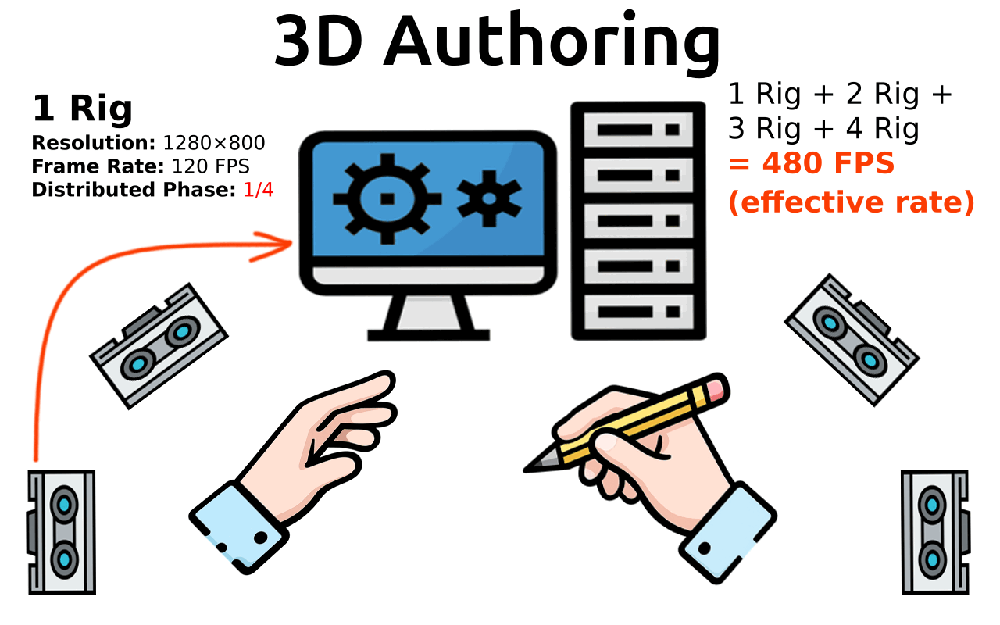

# TDMStrobe

**Time-Division-Multiplexed (TDM) NIR strobe & trigger hub** for multi-camera hand/gesture capture. Designed for **2–4 stereo rigs** (i.e., **4–8 mono cameras**) with small, staggered baselines to improve **precision** and **occlusion robustness**.

- **Per-frame strobing:** supports **single-strobe** patterns (one pulse per exposure).
- **Optics:** the prototype uses **120° emitters** for fast bring-up; production targets **60° / 90°** for higher efficiency (less wasted light, better SNR in the target ROI).
- **Spectrum:** default **850 nm** NIR illumination. **850 nm and 940 nm are both IR-A and not inherently eye-safe**—safe operation depends on irradiance, duty cycle, distance, and exposure time (see **Safety** below).

> **Note:** Off-the-shelf strobe hubs with the required deterministic MCU timing/control are not available; this module is **custom-built**.

> **Safety:** Never look into emitters. Both **850 nm** and **940 nm** can be hazardous at sufficient intensity. **940 nm may reduce visible glow**, but it is **not automatically safer**. See the **Safety** section below.

> **Status:** Early prototype (electronics/firmware WIP). Interfaces, API, and connectors may change.

---

## Features

- **Simple host control over UART:** the MCU is configured from a Raspberry Pi 5 (or any Linux host) via a minimal UART protocol.
- **Deterministic timing on the MCU:** the host only sets parameters; the MCU executes trigger + strobe timing with microsecond-level determinism.
- **Deterministic lighting** for global-shutter stereo/triangulation.
- **TDM (A/B/C/D) phase scheduling** prevents cross-illumination between stereo pairs.
- **Low-latency trigger fan-out** with a simple 4-wire sync option (for chaining / multi-node setups).
- **Integrated dimming** (global & per-channel) for fine-grained brightness control.


## Design goals

- **Deterministic timing:** microsecond-level trigger + strobe timing is executed on the MCU (not in Linux userspace).
- **Low latency:** minimize buffering and keep the host path simple (UART config + status only).
- **Scalable multi-rig:** support **2–4 stereo rigs** by time-slicing illumination into phases (A/B/C/D).
- **Repeatable and debuggable:** explicit states (ARM/RUN/STOP), readable status, and clear fault reporting.
- **Hardware-first safety:** conservative defaults, explicit enable, and documented eye-safety constraints.

---

## What “TDM” means in practice

TDM = **Time Division Multiplexing**. The frame time is split into **phases** (A/B/C/D).  
In each phase, **only one rig (or one illumination group)** is allowed to emit NIR.  
This prevents **cross-illumination** (rig A lighting rig B’s exposure) and keeps stereo matching stable.

### A/B/C/D phase timeline (conceptual)

Example with **4 phases** (A–D) and **up to 4 stereo rigs**.

Assume every stereo rig runs at **120 FPS**. Then each rig has a frame period of:

- **Frame period:** 1 / 120 s = **8.333 ms**

To avoid overlap, we apply a fixed **phase offset** within the 8.33 ms frame period:

- **Rig 1 → Phase A:** offset **0.000 ms → 2.082 ms**
- **Rig 2 → Phase B:** offset **2.083 ms → 4.166 ms** 
- **Rig 3 → Phase C:** offset **4.167 ms → 6.249 ms** 
- **Rig 4 → Phase D:** offset **6.250 ms → 8.332 ms** 
- **Rig 1 → Phase A:** offset **8.333 ms → next frame** 


### Phase shift animation



---

## System Overview (Example: 4 Stereo Rigs)

```
PC (Host) ── Ethernet/RJ45 ─► EdgeTrack Rig 1 ──► UART ──► TDMStrobe Rig 1 (RP2040) as Master
PC (Host) ── Ethernet/RJ45 ─► EdgeTrack Rig 2 ──► UART ──► TDMStrobe Rig 2 (RP2040) as Slave
PC (Host) ── Ethernet/RJ45 ─► EdgeTrack Rig 3 ──► UART ──► TDMStrobe Rig 3 (RP2040) as Slave
PC (Host) ── Ethernet/RJ45 ─► EdgeTrack Rig 4 ──► UART ──► TDMStrobe Rig 4 (RP2040) as Slave

                               *** Daisy Chain ***

        TDMStrobe Rig 1     TDMStrobe Rig 2     TDMStrobe Rig 3     TDMStrobe Rig 4
               ↓                   ↓                   ↓                   ↓
              33Ω                 33Ω                 33Ω                 33Ω
               ↓                   ↓                   ↓                   ↓                              
             2xRJ45      ↔       2xRJ45      ↔       2xRJ45      ↔       2xRJ45
```

* **Up to 4 stereo rigs** (expandable hub style). With 3 or more rigs, up to **8 trigger ports** are available from a “Master” stereo pair fan‑out.
* **UART control** from **Pi 5** (which later exposes a LAN control page/API). Centralized settings for the **whole multi‑stereo setup**; TDMStrobe focuses on lighting/trigger only (including **continuous dimming**).

---

## 🔌 Sync Bus Design (DATA, CLOCK, SYNC)

The TDMStrobe nodes are connected using a **simple 4-wire daisy-chain bus**:

* **DATA** — configuration bits (e.g. phase mask)
* **CLOCK** — bit timing
* **SYNC** — frame start trigger (critical for timing)
* **GND** — common reference

### Bus Topology

The system uses a **daisy-chain wiring approach** for simplicity and minimal connectors:

```
Master → Rig → Rig → Rig
```

All signals are forwarded along the chain. Each node taps into the same shared lines.

---

## ⚠️ Master / Slave Behavior (Critical)

At any given time:

> **Exactly one node is allowed to actively drive the bus.**

### Default state (safe mode)

All nodes are configured as:

```
DATA  → INPUT (high impedance)
CLOCK → INPUT
SYNC  → INPUT
```

This ensures that no device drives the lines unintentionally.

---

### When a node is selected as Master

Only the selected master node switches to:

```
DATA  → OUTPUT
CLOCK → OUTPUT
SYNC  → OUTPUT
```

All other nodes **must remain in INPUT mode**.

---

### ⚠️ Why this is critical

If two nodes drive the same line simultaneously:

* electrical contention occurs (one drives HIGH, another LOW)
* large currents may flow between GPIOs
* signal integrity is destroyed
* hardware damage is possible

> **Therefore, slaves must never be configured as OUTPUT while another master is active.**

---

### Safe Master Switching

When changing the master node:

1. Previous master:

   ```
   OUTPUT → INPUT
   ```
2. Short delay (a few µs)
3. New master:

   ```
   INPUT → OUTPUT
   ```

This prevents bus contention.

---

## 🔧 Series Resistors (33Ω)

For a symmetrical modular design, each shared signal line includes a **33Ω series resistor on every module**:

```text
Driver → 33Ω → Wire → 33Ω → Input
```

This keeps the hardware identical across all nodes, improves signal integrity, and adds basic protection against contention or wiring mistakes.

### Purpose

* reduces signal ringing (especially on cables)
* limits current during transient conflicts
* improves signal integrity over 2–5 m cables
* protects GPIO pins

---

## ⏱️ Deterministic Timing

* **CLOCK + DATA** are used to distribute configuration bits
* **SYNC is the authoritative timing signal**

> All timing-critical actions (exposure, strobe) are triggered from the **SYNC edge**, not from DATA or CLOCK.

Each node:

1. receives configuration via DATA/CLOCK
2. waits for SYNC
3. executes its local phase-offset timing deterministically

---

## 🧠 Design Rationale

This architecture intentionally avoids:

* complex bus protocols (CAN, RS485)
* multi-master arbitration
* software-dependent synchronization

Instead it uses:

* a **single-master broadcast model**
* **hardware-level synchronization (SYNC)**
* **local deterministic timing on each MCU**

This results in:

* microsecond-level reproducibility
* minimal latency
* simple and debuggable behavior

---

## 💡 Notes

* Cable lengths of **2–5 m** are supported with proper grounding and series resistors
* RJ45/Cat5 is suitable for routing the 4-wire bus
* For larger systems or harsher environments, differential signaling (e.g. RS485) may be considered

---

## BOM for Prototype

### MCU / Control

* 1× **Raspberry Pi Pico (RP2040)** — controller for **TDMStrobe**
* 1× **24 V power supply (PSU)**
* 1× **24 V → 5 V buck converter** (for Raspberry Pi 5 / 5 V rail)
* 1× **RC filter** for PWM smoothing (analog dimming / noise reduction)

### Illumination (1 rig)

#### LED Power Stage

* 10× **LED strings / power stages** (choose *one LED family per string)

  * Suggested LED: **3 W class** (e.g., **WEPIR3-E1**) on **MCPCB** (CN sourcing is fine)
  * **Thermal note:** mount MCPCBs to aluminum with proper thermal interface material; heat management is critical.
* 1× **AL8843Q** — constant-current LED driver channels
* Supporting components: **inductors**, **current-sense resistors (R-sense)**, and **ceramic capacitors**

---

### Note: Why not LED COB arrays?

COB arrays look convenient, but they are inefficient for deterministic, strobed NIR illumination. They generate significant heat, often require large optics to shape the beam, and make thermal/mechanical integration harder in compact rigs. Discrete emitters on MCPCBs scale better, cool faster, and allow tighter control over beam pattern, timing, and power distribution.

---

## Sync & Timing

* **Daisy Chain (DATA, CLOCK, and SYNC)**: distributed **EXPOSE/FLASH** and **phase** markers A/B (optionally C/D)
* **Global‑shutter** preferred. For rolling‑shutter, use frame‑interleaved TDM or long enough pulses to cover row exposure
* Typical: **120 Hz** frames; **0.8–1.2 ms** exposure; **200–800 µs** strobe pulses

---

## Firmware (Pico/RP2040)

* UART CLI (baud configurable): set **rate, exposure window, pulse widths, phase map, channel enables**
* **Dimming modes** (per channel & global):

  * **PWM dim**: 100–1000 Hz (LDD/NLDD) or >10 kHz (AL8861/PT4115) as available
  * **Analog dim** (VSET) for AL8861 if preferred
  * **Priority**: When both strobe and dim are active, **strobe pulses are AND‑gated** by the dim level
* Watchdog; **LED‑OFF default** on reset/no‑sync
* Optional temperature input (NTC) → **auto derate** pulses above threshold

---

## Host Integration

* **Pi 5** collects settings via UART → exposes a **LAN REST/GUI** for centralized control
* GUI includes **dimmer controls** (global + per channel) with presets; can store per‑rig exposure/pulse/dim profiles
* Host also coordinates camera triggers and can store per‑rig presets (geometry, gain, exposure)

---

## Roadmap

coming soon. 

---

## License

**Apache‑2.0** (code, firmware, docs). Hardware files: to be added; may use CERN‑OHL‑S.

---

## Safety

### NIR Illumination (850 nm vs 940 nm) & Eye Safety

* **Never look into emitters.** Use black matte **baffles/shields**, aim emitters away from faces, and add **hardware interlocks** (LEDs off on loss of sync, open covers, or presence detection).
* Keep **exposure short** (strobe pulses strictly within camera exposure) and **average irradiance low**.
* Prefer **850 nm band-pass filters** on cameras to reduce the required LED output power.
* **850 nm and 940 nm are both IR-A** and are **not inherently eye-safe**; safety depends on irradiance, geometry, duty cycle, distance, and exposure time (IEC 62471).

### Solution Strategies

**Option A — Prefer more viewpoints over more power (recommended for 940 nm)**
- If **940 nm illumination** is preferred (reduced visible glow), the recommended approach is to **increase the number of stereo rigs (viewpoints)** to maintain SNR while keeping **irradiance low**, rather than compensating with higher-power NIR emitters.

**Option B — Side / rear placement (recommended)**
- Mount stereo pairs **left/right and slightly behind** the workspace, aimed toward the work area. Add **one or two top stereo pairs** for occlusion-free coverage. This directs NIR **away from the eyes** while maintaining uniform scene illumination.
Future refinement: recess-mount one stereo pair near the table center and another near the back edge for a slimmer, more robust setup.

**Option C — Front placement with HMD only**
- If stereo pairs must face forward, operate with a **closed VR headset** (no see-through optics) so the user’s eyes are **occluded**. Baffles and interlocks are still required to protect bystanders.

**Option D — IR-filtering safety eyewear**
- Use **visible-light-transmitting eyewear** that strongly attenuates **near-IR (≈ 780–950 nm)** (specified optical density at **850 nm / 940 nm**) so users retain normal vision while IR exposure is reduced.

**Option E — Side-shield eyewear (“horse-blinkers” concept)**
- Provide **IR-blocking safety glasses with side shields** for operators and visitors when emitters face forward. Ensure proper **near-IR attenuation ratings** and a snug fit to block off-axis radiation.

---

## Disclaimer

Prototype hardware. Use at your own risk. Ensure eye‑safety and proper thermal design in all setups.
